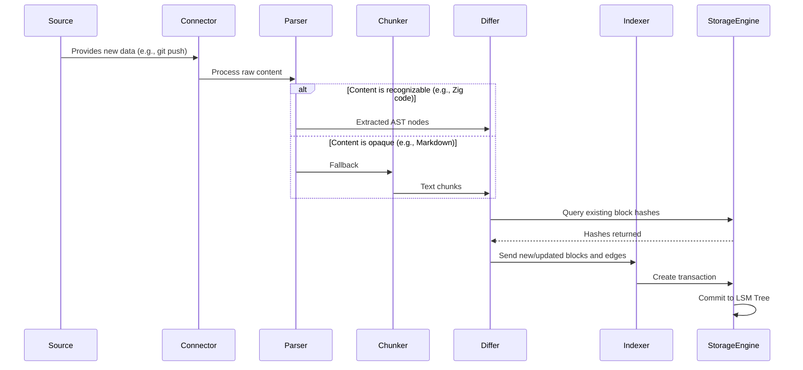

# Ingestion Pipeline Specification

The Ingestion Pipeline is responsible for the 'A' (Automation) in the CLAUDE principles. It is the system that finds, processes, and stores knowledge, turning unstructured or semi-structured external data into the structured Context Blocks and Knowledge Graph of CortexDB.

## Flow Diagram

## Pipeline Stages

1.  **Source Connector**
    *   **Responsibility:** Interface with the outside world.
    *   **Implementation:** A pluggable module. Initial connectors include a Git poller that checks for new commits and a simple directory watcher.
    *   **Output:** A stream of raw data (`[]const u8`) and a source URI (e.g., `git://github.com/cortexdb/cortexdb?commit=...&path=...`).

2.  **Parser**
    *   **Responsibility:** Convert raw data into semantic units.
    *   **Implementation:** A dispatching mechanism that selects a language-specific parser based on file type or other metadata. It uses Abstract Syntax Trees (ASTs) to identify functions, structs, comments, etc., as candidate blocks.
    *   **Output:** A list of proto-blocks (content + metadata like line numbers) and the relationships between them.

3.  **Chunker (Fallback)**
    *   **Responsibility:** Handle data that cannot be parsed semantically.
    *   **Implementation:** If the Parser stage fails, the data is sent to the Chunker. It uses heuristics to split text, such as splitting by Markdown sections, paragraphs, or sentence boundaries.
    *   **Output:** A list of proto-blocks with less precise boundaries and no relational edges.

4.  **Differ**
    *   **Responsibility:** Prevent redundant work and data duplication.
    *   **Implementation:** For each proto-block, the Differ computes a strong hash (e.g., Blake3) of its content. It queries the storage engine to see if a block with that content hash already exists.
    *   **Output:** Filters the list to only include blocks whose content has changed or is entirely new.

5.  **Indexer**
    *   **Responsibility:** Assemble the final database transaction.
    *   **Implementation:** Takes the list of new/updated blocks and their edges. It assigns new 128-bit IDs, increments version numbers for updated blocks, and serializes them into `LSMTLogEntry` format.
    *   **Output:** A single, atomic transaction that is passed to the storage engine to be replicated and committed.
