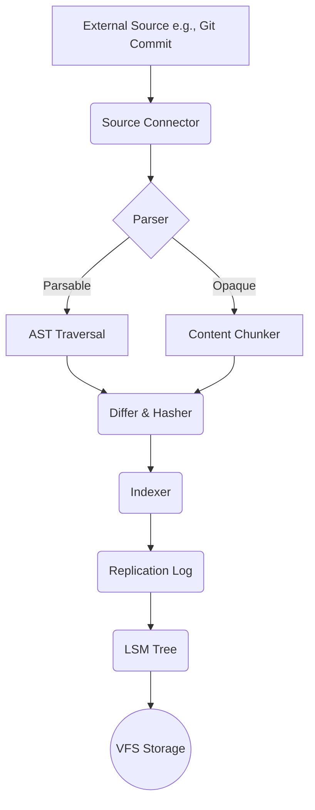
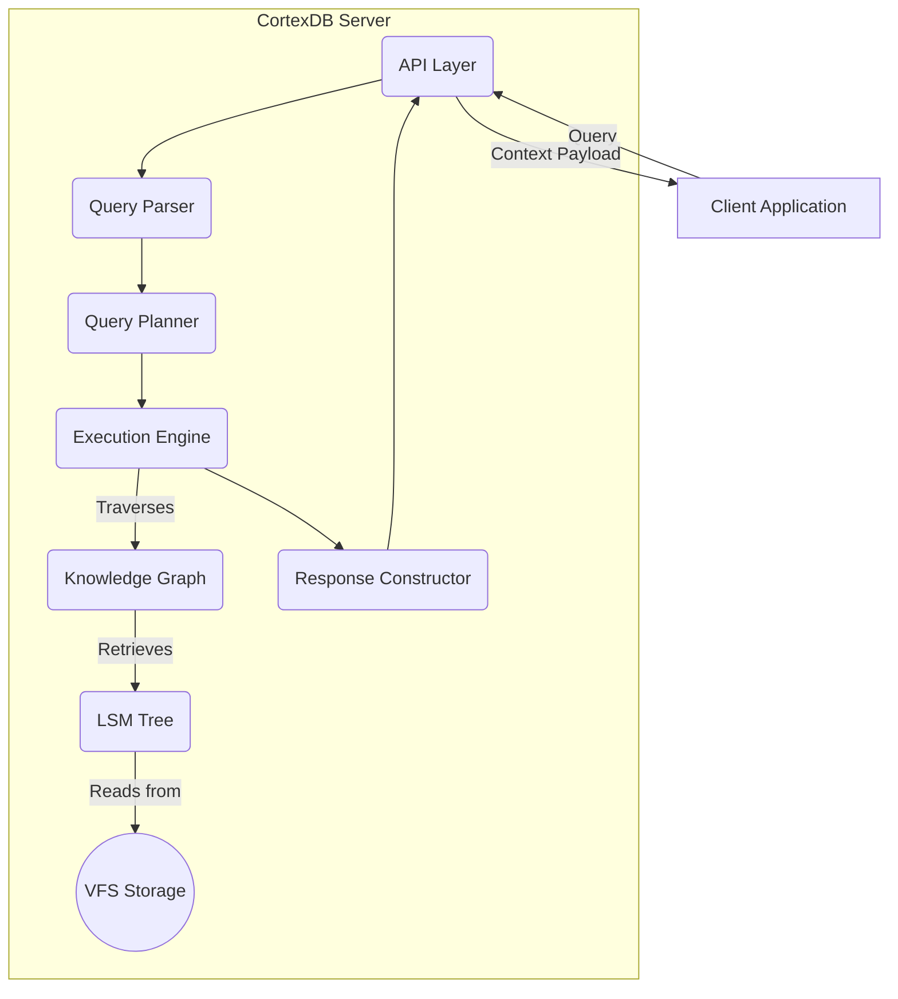

# Architecture Overview

This document provides a high-level overview of the CortexDB system, tracing the flow of data during both write (ingestion) and read (query) operations.

## Guiding Principles

The architecture is built on three pillars:

1.  **Component Isolation:** The system is composed of distinct components (Storage Engine, Query Engine, Ingestion Pipeline) that communicate over well-defined, narrow interfaces.
2.  **Single-Threaded Asynchronous Execution:** The core server runs in a single thread, using Zig's `async` framework to handle concurrent operations. This eliminates complex locking and data races, simplifying the design.
3.  **Simulation-First Design:** Every component that performs I/O (disk or network) is written against an abstraction (the VFS/VNet). This allows the entire system to be run in a deterministic simulation for robust testing.

## Write Path: Ingestion Flow

The ingestion path is how external knowledge is transformed into structured, queryable Context Blocks within the database.

1.  **Source Connector:** A plugin that monitors an external source (e.g., polling a Git repository, listening to a webhook). It fetches the raw content.
2.  **Parser/Chunker:** The system attempts to parse the content with a language-specific parser (e.g., for Zig code). If successful, it extracts semantic units (structs, functions). If not, it falls back to a generic "chunker" that splits the text by paragraphs or sections.
3.  **Differ & Hasher:** Each potential Context Block's content is hashed. This hash is compared against existing blocks to avoid writing redundant data. This is the "auto-updating" mechanism.
4.  **Indexer:** Compiles a list of new/updated blocks and their relationships (edges) into a single atomic transaction.
5.  **Replication & Storage:** The transaction is written to a replication log, sent to peer nodes for consensus, and finally committed to the local storage engine (LSM Tree), which writes it to disk via the VFS.

## Read Path: Query Flow

The query path is how a client retrieves structured context to be fed into an LLM.

1.  **API Layer:** Listens for client connections and receives query requests over the binary protocol.
2.  **Query Parser:** Parses the query string into a structured Abstract Syntax Tree (AST).
3.  **Query Planner:** Analyzes the query AST and creates an efficient execution plan (e.g., "first fetch this block by ID, then follow `IMPORTS` edges for two levels").
4.  **Execution Engine:** Executes the plan. It fetches the initial blocks from the LSM-Tree and traverses the Knowledge Graph, collecting block IDs that match the query.
5.  **Response Constructor:** Retrieves the full content of the collected block IDs from storage. It then assembles them into the final structured context payload, which is sent back to the client.
